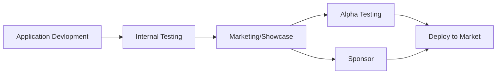

# Welcome to NoFlee.com
Noflee.com is a world first social platform to expose hit-and-run offenders and help the community share and find crucial evidence.

**NoFlee.com** is a community-driven application designed to combat hit-and-run incidents by empowering individuals to capture, report, and share critical evidence. With features like real-time incident recording, license plate recognition, and a secure evidence repository, the app ensures victims have the tools they need to hold offenders accountable.

By promoting awareness and accountability, **NoFlee.com** helps deter reckless behavior, fosters safer roads, and strengthens community solidarity against irresponsible driving. Together, we can take a stand and ensure justice for all.

## Roadmap

## Word from our team
Our project is in its very early stages, and we are passionate about bringing this service to life to make a meaningful impact. We are committed to offering this service for free, making it accessible to everyone. At this pivotal point, any support—whether through feedback, sharing with others, or helping us spread the word—would be immensely valuable and greatly appreciated as we work toward building a stronger and more inclusive community!